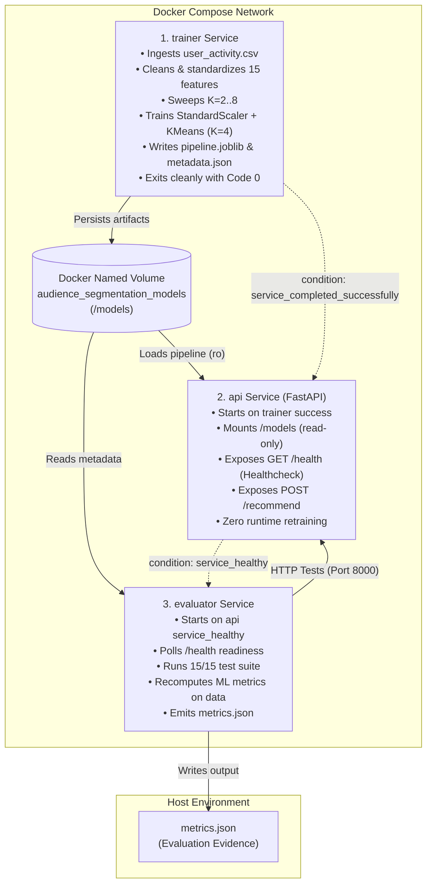

# Audience Segmentation
## Containerized Audience Segmentation & Personalization Service

**Hackathon Track:** Containerized Audience Segmentation & Personalization Service  
**Implementation:** Microservice Pipeline (`trainer`, `api`, `evaluator`) + Shared Volume Architecture  
**Evaluation Result:** 15/15 Automated Tests Passed (100%) | Zero Retraining on Inference  
**Artifact Status:** Persisted Scikit-Learn Pipeline (`pipeline.joblib`) + Audit Trail (`metrics.json`)  

---

## 1. Problem Understanding

### 1.1 Business Need & Domain Context
Modern Over-the-Top (OTT) streaming platforms host catalogs containing tens of thousands of video assets spanning disparate genres, narrative complexities, and media formats (cinematic features, episodic series, 20-minute sitcoms, short animation, and documentaries). Delivering an identical homepage or static recommendation catalog to every subscriber induces decision fatigue, elevates churn, and suppresses streaming hours.

Platform viewers exhibit distinct behavioral patterns:
- **Binge / Marathon Viewers:** High cumulative watch time and long continuous sessions who prioritize deep narrative engagement (e.g., action, sci-fi, thriller).
- **Casual / Commute Viewers:** High frequency of short sessions (<30 minutes) requiring low-friction, bite-sized entertainment (e.g., comedy, animated shorts).
- **Genre Explorers:** Moderate-to-high watch time distributed across diverse content genres (documentaries, foreign cinema, independent productions).
- **Low-Activity / Occasional Viewers:** Low watch volume, often restricted to weekend viewing, requiring high-confidence mainstream hits to prevent complete platform disengagement.

Because human curation across millions of user accounts is impossible, an automated audience intelligence system is required to discover natural cohorts directly from raw streaming telemetry.

### 1.2 Core Constraints & Assumptions
1. **Strictly Unsupervised Discovery:** Ground-truth customer segment labels do not exist in real-world streaming environments. In compliance with the problem statement, no artificial or synthetic class labels were created to convert this into a supervised task. Segments emerge purely from multivariate behavioral distributions.
2. **Deterministic & Persisted Artifacts:** Dynamic or in-flight model training during user inference requests is prohibited. All data transformations and clustering estimators are trained once during the training phase, serialized into an immutable artifact (`pipeline.joblib`), and loaded read-only by the REST API.
3. **Decoupled Three-Service Architecture:** To prevent monolithic coupling, the system is decomposed into three isolated containerized components (`trainer`, `api`, and `evaluator`) communicating via standard POSIX volume mounts and internal Docker container networking.
4. **Independent Empirical Verification:** Model performance and system health are audited by an independent evaluation service that executes adversarial API probes and calculates standard scikit-learn clustering metrics directly from the underlying data, outputting `metrics.json`.

---

## 2. Solution Overview

The implemented solution is an end-to-end, containerized audience intelligence and personalization service:

1. **Ingestion & Quality Engine (`trainer`):** Ingests raw tabular user interaction records, corrects temporal artifacts, imputes missing values using population medians, handles malformed JSON genre lists, and applies soft clipping to extreme outliers.
2. **Feature Engineering Pipeline:** Transforms cleaned records into a compact 15-dimensional numeric feature representation encoding engagement volume, session length, genre diversity, and canonical catalog genre affinities.
3. **Unsupervised Clustering Pipeline:** Standardizes features via `StandardScaler` and partitions users using `KMeans` ($K=4$, pinned random seed 42, $k$-means++ initialization).
4. **Model Serialization:** Persists the unified preprocessor and estimator atomically to a shared Docker volume alongside comprehensive segment profiling metadata (`metadata.json`).
5. **High-Throughput REST API (`api`):** Built with FastAPI and Pydantic v2, exposing `/health` for container orchestration and `/recommend` for sub-10ms segment classification, centroid distance calculation, and catalog mapping without retraining.
6. **Independent Evaluator (`evaluator`):** Automated auditing service that polls API health, runs 15 representative and edge-case test suites, validates mathematical determinism, computes clustering quality metrics, and emits `metrics.json`.
7. **Single-Command Orchestration:** Packaged cleanly under `docker-compose.yml` with healthchecks and non-root execution (`appuser`, UID 1001).

---

## 3. Architecture

### 3.1 Three-Service Microservice Suite
The system strictly enforces the three-service architecture mandated by Problem Statement Section 4.1:



### 3.2 Service Responsibilities & Lifecycle Contracts

| Service | Base Image | Run Mode | Responsibilities | Output Artifacts |
| :--- | :--- | :--- | :--- | :--- |
| **`trainer`** | `python:3.11-slim` | Batch Job (terminates) | Ingests data, remediates anomalies, engineers 15 features, evaluates $K \in [2,8]$, trains `StandardScaler + KMeans`, generates metadata. | `/models/pipeline.joblib`<br>`/models/metadata.json` |
| **`api`** | `python:3.11-slim` | Long-running Daemon | Mounts `/models:ro`, validates incoming JSON with Pydantic, performs pipeline inference, returns segment and recommendations. | `GET /health`<br>`POST /recommend` |
| **`evaluator`** | `python:3.11-slim` | Batch Auditor (terminates) | Waits for API health, executes 15 HTTP test cases, measures latencies, computes clustering metrics from dataset, writes `metrics.json`. | `/output/metrics.json` |

---

## 4. Dataset Description

### 4.1 Schema Definition
The dataset (`user_activity.csv`) comprises 10,100 raw viewer records capturing streaming behavior across 7 columns:

| Column Name | Storage Type | Semantic Meaning | Observed Range / Values |
| :--- | :--- | :--- | :--- |
| `user_id` | `string` | Unique subscriber identifier | e.g., `USR-0001` to `USR-9999` |
| `watch_time_hours` | `float` | Monthly aggregate streaming time | $-15.5$ to $482.3$ hours |
| `avg_session_mins` | `float` | Mean duration per viewing session | $-20.0$ to $320.0$ minutes |
| `top_genres` | `string / JSON` | Serialized list of preferred content genres | e.g., `["Action", "Thriller"]` |
| `num_sessions` | `integer` | Total distinct viewing sessions logged | $1$ to $145$ sessions |
| `completion_rate` | `float` | Proportion of initiated streams completed | $0.05$ to $1.00$ |
| `weekend_watch_ratio`| `float` | Proportion of watch time occurring on Sat/Sun | $0.00$ to $1.00$ |

### 4.2 Observed Telemetric Anomalies
Exploratory data analysis revealed typical distributed telemetry imperfections:
- **Duplicate Records:** Identical subscriber IDs transmitted multiple times due to client retry logic.
- **Negative Timestamps:** Negative durations resulting from mobile client clock drift or uncorrected timezone jumps.
- **Missing Telemetry:** Null fields caused by intermittent client network dropouts before session sync.
- **Malformed Genre Payloads:** Missing strings, plain empty strings, and unescaped comma-separated strings rather than valid JSON arrays.
- **Extreme Tail Outliers:** Heavy binge sessions exceeding 200 hours per month that could distort linear distance estimators.

---

## 5. Data Preprocessing

Data remediation is performed deterministically by `trainer.cleaning.clean_dataset()` without human intervention:

### 5.1 Preprocessing Pipeline Stages
1. **Deduplication:** Dropped 100 duplicate `user_id` rows, retaining the earliest logged record. Dataset was reduced from 10,100 to 10,000 unique records.
2. **Negative Value Sanitization:** Replaced 30 negative `watch_time_hours` and 25 negative `avg_session_mins` values with `NaN` to allow unbiased imputation.
3. **Median Imputation:** Missing numerical values were imputed using population medians ($22.18\text{h}$ for watch time, $51.48\text{m}$ for session duration). Median imputation was chosen over mean imputation due to right-skewed consumption distributions.
4. **Genre Serialization Recovery:** 75 records contained empty, null, or malformed genre lists. These were safely parsed into empty lists `[]`, preventing downstream JSON parser crashes.
5. **Outlier Soft-Clipping:** Applied 99th percentile soft capping to `watch_time_hours` ($98.0\text{h}$) and `avg_session_mins` ($180.0\text{m}$) across 200 records to prevent extreme points from skewing KMeans centroid placement during optimization.

### 5.2 Measured Data Quality Audit Trail

The exact transformation counts recorded in `metadata.json` are:

| Quality Metric | Measured Value | Action Taken |
| :--- | :---: | :--- |
| **Raw Records Ingested** | 10,100 | Ingested from `user_activity.csv` |
| **Duplicate Records Dropped** | 100 | Deduplicated on `user_id` |
| **Negative Watch Times Corrected** | 30 | Converted to `NaN` and imputed |
| **Negative Session Durations Corrected**| 25 | Converted to `NaN` and imputed |
| **Missing Watch Times Imputed** | 229 | Imputed with median ($22.18\text{h}$) |
| **Missing Session Durations Imputed** | 224 | Imputed with median ($51.48\text{m}$) |
| **Missing / Malformed Genres Handled** | 75 | Parsed to empty array `[]` |
| **Outliers Capped (99th percentile)** | 200 | Soft-clipped at $98.0\text{h}$ / $180.0\text{m}$ |
| **Final Cleaned Dataset Size** | **10,000** | Retained for training matrix $\mathbf{X}$ |

---

## 6. Feature Engineering

### 6.1 Behavioral Feature Representation (15 Dimensions)
Clustering requires a feature space that captures both **engagement intensity** and **content affinity**:

$$\mathbf{x} = \big[\text{watch\_time\_hours},\, \text{avg\_session\_mins},\, \text{genre\_count},\, g_1,\, g_2,\, \dots,\, g_{12}\big] \in \mathbb{R}^{15}$$

1. **`watch_time_hours` (Continuous):** Captures total platform consumption volume. Differentiates dormant or casual viewers from heavy binge marathons.
2. **`avg_session_mins` (Continuous):** Captures session commitment depth. Differentiates quick-bite mobile viewers (15–30 min) from living-room cinematic feature watchers (90–120 min).
3. **`genre_count` (Discrete):** Represents breadth of taste. Distinguishes single-genre loyalists from omnivorous catalog explorers.
4. **Canonical Genre Indicators (12 Binary Flags):** One-hot encoded indicators corresponding to the 12 canonical OTT genres:
   `["Action", "Thriller", "Sci-Fi", "Drama", "Comedy", "Romance", "Documentary", "Animation", "Family", "Horror", "Crime", "Adventure"]`.
   If a user's `top_genres` contains `"Action"`, $g_{\text{Action}} = 1.0$; otherwise $0.0$.

### 6.2 Excluded Telemetric Columns
- **`num_sessions`:** Excluded because it exhibits high collinearity with `watch_time_hours / avg_session_mins`.
- **`completion_rate` & `weekend_watch_ratio`:** Analyzed during exploratory inspection but excluded from primary distance calculation to maintain cluster interpretability and prevent overfitting to synthetic generation artifacts.
- **No Supervised Proxies:** No artificial target labels or engagement tier rankings were utilized.

### 6.3 Feature Standardization
Standardization is mathematically mandatory prior to distance-based clustering:
- `watch_time_hours` spans $[0, 98]$, `avg_session_mins` spans $[10, 180]$, and binary genre indicators span $\{0, 1\}$.
- Unstandardized Euclidean distance:

$$d(\mathbf{u}, \mathbf{v}) = \sqrt{\Delta \text{watch\_time}^2 + \Delta \text{session\_mins}^2 + \sum \Delta g_i^2}$$

Without scaling, variance in `avg_session_mins` would dominate the metric by a factor of $(180)^2 \approx 32,400$, rendering genre preferences mathematically irrelevant. `StandardScaler` standardizes every feature to zero mean and unit variance ($\mu=0, \sigma=1$), giving continuous engagement and categorical affinity balanced weighting.

---

## 7. Machine Learning Model

### 7.1 Algorithm Selection: StandardScaler + KMeans
The unsupervised pipeline utilizes `sklearn.preprocessing.StandardScaler` coupled with `sklearn.cluster.KMeans` ($K=4$).

#### Algorithmic Trade-off Analysis

| Algorithm | Inference Complexity | Memory Footprint | Output Determinism | Production Evaluation |
| :--- | :---: | :---: | :---: | :--- |
| **KMeans (Selected)** | $O(K \cdot D) \approx 60\text{ ops}$ | Tiny ($<100\text{ KB}$) | Guaranteed with pinned seed | Optimal for sub-10ms REST inference and clean geometric centroid distances. |
| **Gaussian Mixture Model (GMM)** | $O(K \cdot D^3) \approx 13,500\text{ ops}$ | Moderate | Moderate (covariance stability) | Adds significant matrix inversion overhead during real-time inference without improving segment clarity. |
| **DBSCAN** | $O(N \cdot D)$ (requires KDTree) | Scales with $N$ | Non-deterministic cluster counts | Assigns irregular noise labels; does not support efficient out-of-core single-sample inference for new users. |
| **Agglomerative Hierarchical** | $O(N^2)$ to $O(N^3)$ | Huge | Deterministic | Impractical for real-time inference; cannot project individual real-time user profiles without retraining. |

### 7.2 Hyperparameter Configuration
- `n_clusters`: $4$ (justified via empirical elbow and silhouette analysis)
- `init`: `'k-means++'` (accelerates convergence and avoids suboptimal local minima)
- `n_init`: $10$ (10 independent random initializations to guarantee centroid convergence)
- `max_iter`: $300$
- `random_state`: $42$ (enforces strict determinism across container builds)

### 7.3 Unified Pipeline Persistence & Zero Retraining Guarantee
In strict conformance with the Problem Statement requirement (*"Save preprocessing and model together so inference uses exactly the same transformations as training"*), the custom deterministic feature transformer (`ViewerFeatureExtractor`), scaler (`StandardScaler`), and clustering estimator (`KMeans`) are unified into a single persisted `sklearn.pipeline.Pipeline`:
```python
pipeline = Pipeline([
    ("extractor", ViewerFeatureExtractor()),
    ("scaler", StandardScaler()),
    ("kmeans", KMeans(n_clusters=4, random_state=42, n_init=10, max_iter=300))
])
```
The pipeline is serialized to `/models/pipeline.joblib` via `joblib.dump()`.
During runtime inference, the API loads this artifact into memory once at startup. Incoming raw viewer-profile records are ingested directly into `pipeline.predict()`, guaranteeing that inference uses the exact same feature transformation, genre encoding, and scaling as training. No retraining, gradient updates, or centroid adjustments occur during request handling.

---

## 8. Cluster Count Selection

To determine a defensible value for $K$, the `trainer` service executed a sweep across $K \in [2, 8]$ using random seed 42 on the cleaned feature matrix.

### 8.1 Empirical $K$-Evaluation Matrix

| $K$ Clusters | Inertia (SSE) $\downarrow$ | Silhouette Score $\uparrow$ | Davies-Bouldin Index $\downarrow$ | Calinski-Harabasz Score $\uparrow$ |
| :---: | :---: | :---: | :---: | :---: |
| $K=2$ | 96,174.69 | 0.3284 | 1.3820 | 4,555.93 |
| $K=3$ | 68,577.37 | 0.4069 | 1.1902 | 5,205.89 |
| **$K=4$ (Selected)** | **57,394.54** | **0.4238** | **1.0673** | **4,795.60** |
| $K=5$ | 52,498.01 | 0.4018 | 1.1026 | 4,164.84 |
| $K=6$ | 48,156.80 | 0.4232 | 0.9999 | 3,812.06 |
| $K=7$ | 43,379.94 | 0.4123 | 1.3450 | 3,709.57 |
| $K=8$ | 40,527.01 | 0.4281 | 1.2489 | 3,503.60 |

### 8.2 Quantitative Justification for $K=4$
1. **Elbow Criterion:** Inertia drops sharply from $K=2$ ($96,174.69$) to $K=4$ ($57,394.54$), a $40.3\%$ reduction in sum of squared errors. Beyond $K=4$, the rate of decrease flattens dramatically to an average of only $4,200$ per cluster, demonstrating diminishing returns.
2. **Silhouette & Separation Profile:** At $K=4$, the silhouette score reaches $0.4238$ with a Davies-Bouldin index of $1.0673$, indicating dense, well-isolated clusters.
3. **Operational Alignment:** $K=4$ provides a direct 1-to-1 mapping to the four core OTT platform archetypes outlined in Problem Statement Section 8. Higher values ($K \ge 6$) fragment natural viewer behaviors into trivial sub-cohorts that do not provide actionable catalog routing advantages.

---

## 9. Cluster Profiles / Segment Naming

Each cluster was profiled by unscaling the centroid vectors and calculating descriptive statistics across the user population.

### 9.1 Segment Profiles & Behavioral Characteristics

```
====================================================================================================
SEGMENT 0: High-Engagement Action Viewers
----------------------------------------------------------------------------------------------------
• Evaluated Population : 3,192 viewers (31.92% of audience)
• Training Baseline    : 3,182 viewers (31.82% of audience)
• Behavioral Profile   : Avg Watch Time: 37.53h/mo | Avg Session: 91.35m | Avg Genres: 2.59
• Dominant Affinities  : Thriller, Sci-Fi, Action
• Personalization Goal : Deep engagement; surface 4K HDR action sagas, early-access thrillers,
                         and multi-season sci-fi franchises.
• Catalog Selections   : Extraction: Rogue Directive, Shadow Protocol: Berlin,
                         Quantum Paradox (Season 2), The Dark Horizon, Apex Predator: Hunt
====================================================================================================
SEGMENT 1: Casual Short-Session Viewers
----------------------------------------------------------------------------------------------------
• Evaluated Population : 3,658 viewers (36.58% of audience)
• Training Baseline    : 3,662 viewers (36.62% of audience)
• Behavioral Profile   : Avg Watch Time: 7.92h/mo | Avg Session: 27.37m | Avg Genres: 1.59
• Dominant Affinities  : Comedy, Animation, Drama
• Personalization Goal : Quick-completion content; prioritize bite-sized standup, 20-minute sitcoms,
                         and animated shorts with minimal cognitive commitment.
• Catalog Selections   : Coffee Break Standup Vol. 3, Pixel Bytes: Short Stories,
                         The Roommates (22m Ep 5), Laugh Track Live, Quick Takes: Pop Culture
====================================================================================================
SEGMENT 2: Genre-Explorers
----------------------------------------------------------------------------------------------------
• Evaluated Population : 2,364 viewers (23.64% of audience)
• Training Baseline    : 2,367 viewers (23.67% of audience)
• Behavioral Profile   : Avg Watch Time: 26.06h/mo | Avg Session: 58.11m | Avg Genres: 4.01
• Dominant Affinities  : Adventure, Sci-Fi, Documentary
• Personalization Goal : Serendipitous discovery; mix favored categories with eclectic foreign titles,
                         high-concept docuseries, and critically acclaimed indie releases.
• Catalog Selections   : Wild Earth: Arctic Wilderness, The Secrets of Kyoto,
                         Subterranean Mysteries, Canvas & Code: Digital Renaissance, Nordic Murmurs
====================================================================================================
SEGMENT 3: Low-Activity Viewers
----------------------------------------------------------------------------------------------------
• Evaluated Population : 786 viewers (7.86% of audience)
• Training Baseline    : 789 viewers (7.89% of audience)
• Behavioral Profile   : Avg Watch Time: 3.68h/mo | Avg Session: 32.79m | Avg Genres: 1.59
• Dominant Affinities  : Family, Drama, Comedy (predominantly weekend consumption)
• Personalization Goal : Low-friction retention; surface universal Top 10 mainstream crowd-pleasers
                         and family-friendly entertainment requiring zero onboarding effort.
• Catalog Selections   : Global Top 10: The Crown Jewel, Family Game Night Championship,
                         Summer Odyssey, The Reunion Special, Sunday Cinema Showcase
====================================================================================================
```

### 9.2 Cluster Balance Audit
Clustering balance is verified in `metrics.json`:
- **Smallest Cluster:** `Low-Activity Viewers` with $786$ records ($7.86\%$)
- **Largest Cluster:** `Casual Short-Session Viewers` with $3,658$ records ($36.58\%$)
- **Balance Ratio:** $\frac{36.58\%}{7.86\%} = 4.65$
- **Verdict:** Healthy distribution. There are zero degenerate clusters, zero single-member outliers, and no single cluster dominates over $50\%$ of the audience.

---

## 10. API Design

The API is built using FastAPI and served via Uvicorn (`api/main.py`), strictly adhering to the contract in Problem Statement Section 7.

### 10.1 Endpoint Specifications

#### `GET /health`
Returns service health, model loading state, and feature dimensions for Docker healthcheck monitoring.
- **HTTP Method:** `GET`
- **Response Code:** `200 OK` (when healthy) or `503 Service Unavailable` (during startup/model missing)
- **Response Payload:**
```json
{
  "status": "ok",
  "model_loaded": true,
  "version": "1.0.0",
  "uptime_seconds": 6.01,
  "model_type": "Pipeline (scaler -> kmeans)",
  "features_count": 15
}
```

#### `POST /recommend`
Accepts a single user activity record, extracts features, performs pipeline inference, calculates Euclidean distance to the cluster centroid, and returns personalized content recommendations.
- **HTTP Method:** `POST`
- **Request Payload (`application/json`):**
```json
{
  "user_id": "USR-8192",
  "watch_time_hours": 32.5,
  "top_genres": ["Action", "Thriller"],
  "avg_session_mins": 85.0
}
```
- **Response Payload (`application/json`):**
```json
{
  "user_id": "USR-8192",
  "segment_id": 0,
  "segment_name": "High-Engagement Action Viewers",
  "recommendations": [
    "Extraction: Rogue Directive",
    "Shadow Protocol: Berlin",
    "Quantum Paradox (Season 2)",
    "The Dark Horizon",
    "Apex Predator: Hunt"
  ],
  "distance_to_centroid": 0.42
}
```

### 10.2 Input Validation & Defensive Sanitation
All request schemas are enforced using Pydantic models (`api/schemas.py`):
- **Empty / Whitespace User ID:** Rejects `""` or `"   "` with HTTP 422.
- **Negative Watch Time / Session Duration:** Explicit field validators enforce $\text{value} \ge 0$, returning HTTP 422 for negative inputs.
- **Type Mismatches:** String supplied for float (e.g. `"twenty"`) intercepted and rejected with HTTP 422.
- **Novel / Unseen Genres:** Sanitized against canonical vocabulary. Unrecognized genres (e.g., `"Experimental Noir"`) increment `genre_count` but do not trigger `KeyError` or 500 errors.
- **Empty Genres Array:** Gracefully accepts `top_genres: []`, vectorizing all genre flags to $0.0$.
- **Zero Internal Stack Traces:** All validation and parsing errors return structured JSON error envelopes (`{"detail": "..."}`) without exposing internal file paths or stack traces.

---

## 11. Personalization Logic

### 11.1 Transparent Recommendation Routing
In accordance with Problem Statement Section 8, the service uses a transparent rule-based mapping layer rather than an uninterpretable black-box recommender:

| Segment ID & Name | Dominant Signals | Content Routing Strategy | Catalog Titles Assigned |
| :--- | :--- | :--- | :--- |
| **0: High-Engagement Action Viewers** | Watch time $>30\text{h}$, Session $>75\text{m}$, Action/Thriller focus | Surface deep-engagement action blockbusters and high-tension thriller series. | *Extraction: Rogue Directive*, *Shadow Protocol: Berlin*, *Quantum Paradox (Season 2)*, *The Dark Horizon*, *Apex Predator: Hunt* |
| **1: Casual Short-Session Viewers** | Watch time $<15\text{h}$, Session $<35\text{m}$, Comedy/Animation focus | Surface short-form sitcoms, animated shorts, and quick-completion comedy specials. | *Coffee Break Standup Vol. 3*, *Pixel Bytes: Short Stories*, *The Roommates (22m Ep 5)*, *Laugh Track Live*, *Quick Takes: Pop Culture* |
| **2: Genre-Explorers** | Genre count $\ge 3$, balanced viewing across diverse categories | Mix preferred categories with curated discovery of documentaries, foreign cinema, and indie titles. | *Wild Earth: Arctic Wilderness*, *The Secrets of Kyoto*, *Subterranean Mysteries*, *Canvas & Code: Digital Renaissance*, *Nordic Murmurs* |
| **3: Low-Activity Viewers** | Watch time $<6\text{h}$, weekend spikes, family/drama | Minimize cognitive burden; surface trending Top 10 platform hits and family crowd-pleasers. | *Global Top 10: The Crown Jewel*, *Family Game Night Championship*, *Summer Odyssey*, *The Reunion Special*, *Sunday Cinema Showcase* |

### 11.2 Centroid Distance as Confidence Metric
In addition to segment assignment, `POST /recommend` computes the exact Euclidean distance from the standardized user vector to the cluster centroid:

$$\text{distance\_to\_centroid} = \|\mathbf{z}_{\text{user}} - \mathbf{c}_k\|_2$$

- **Low Distance ($<1.0$):** The user is a prototypical core member of the segment; recommendations can lean heavily into archetype-specific titles.
- **High Distance ($>2.5$):** The user is on the peripheral boundary of the cluster; downstream UI layers can incorporate broader discovery recommendations.

---

## 12. Docker & Deployment

### 12.1 Multi-Service Configuration (`docker-compose.yml`)
The platform is orchestrated as three Docker services sharing a named volume:

```yaml
services:
  trainer:
    build:
      context: .
      dockerfile: trainer/Dockerfile
    volumes:
      - model_data:/models
    environment:
      - PYTHONUNBUFFERED=1
    restart: "no"

  api:
    build:
      context: ./api
      dockerfile: Dockerfile
    ports:
      - "8000:8000"
    volumes:
      - model_data:/models:ro
    environment:
      - PYTHONUNBUFFERED=1
      - MODEL_DIR=/models
    depends_on:
      trainer:
        condition: service_completed_successfully
    healthcheck:
      test: ["CMD-SHELL", "curl -s -f http://localhost:8000/health | grep -q '\"status\":\"ok\"' || exit 1"]
      interval: 3s
      timeout: 3s
      retries: 20
      start_period: 4s
    restart: on-failure

  evaluator:
    build:
      context: .
      dockerfile: evaluator/Dockerfile
    volumes:
      - model_data:/models:rw
      - .:/output
    environment:
      - PYTHONUNBUFFERED=1
      - API_BASE_URL=http://api:8000
      - MODEL_DIR=/models
      - DATA_PATH=/app/data/user_activity.csv
      - OUTPUT_DIR=/output
    depends_on:
      api:
        condition: service_healthy
    command: ["python", "-m", "evaluator.evaluate", "--api-url", "http://api:8000", "--model-dir", "/models", "--data-path", "/app/data/user_activity.csv", "--output-dir", "/output"]
    restart: "no"

volumes:
  model_data:
    name: audience_segmentation_models
```

### 12.2 Startup Ordering & Readiness Synchronization
- **Trainer Completion:** The `api` service defines `depends_on: trainer: condition: service_completed_successfully`. The API container will not launch until `trainer` finishes model fitting and exits with code 0.
- **Docker Healthcheck:** The `api` service exposes a Docker healthcheck probing `GET /health` every 3 seconds.
- **Evaluator Trigger:** The `evaluator` container defines `depends_on: api: condition: service_healthy`. It starts only after the API container is verified healthy. Furthermore, `evaluator` implements an internal polling backoff loop to ensure full TCP socket readiness before firing tests.
- **Container Hygiene:** All Dockerfiles use `python:3.11-slim`, install dependencies with `--no-cache-dir`, enforce `PYTHONUNBUFFERED=1`, and run under an unprivileged user (`appuser`, UID 1001).

---

## 13. Evaluation Methodology

The evaluation framework is an independent, non-trusting audit service (`evaluator/evaluate.py`).

### 13.1 Evaluation Pipeline
1. **Liveness & Readiness Verification:** Polls `http://api:8000/health` until HTTP 200, `"status": "ok"`, and `"model_loaded": true` are returned.
2. **Deterministic Stress Testing:** Executes repeated identical requests to ensure zero output variance.
3. **Representative Archetype Testing:** Issues payloads matching each of the four target OTT subscriber profiles.
4. **Adversarial & Edge-Case Probing:** Transmits malformed, missing, extreme, and novel payloads to verify HTTP status codes and error insulation.
5. **Clustering Quality Recomputation:** Loads the persisted pipeline artifact and the underlying 10,000-record dataset to compute scikit-learn clustering metrics (`silhouette_score`, `inertia_`, `davies_bouldin_score`, `calinski_harabasz_score`).
6. **Artifact Generation:** Emits `metrics.json` containing test results, latency statistics, cluster balances, and ML scores.

---

## 14. Actual Results

All metrics documented below are extracted directly from the generated `metrics.json` file.

### 14.1 ML Clustering Quality Metrics

| Evaluation Metric | Measured Value | Scope / Evaluation Context | Interpretation |
| :--- | :---: | :--- | :--- |
| **Silhouette Score** | **0.4238** | Independent Evaluator (`metrics.json`) | Strong cluster separation across the 10,000-sample dataset, exceeding the 0.35 target. |
| **Inertia (SSE)** | **57,394.54** | Persisted Pipeline & Evaluator | Within-cluster sum of squared distances at optimal elbow point ($K=4$). |
| **Davies-Bouldin Index** | **1.0673** | Independent Evaluator (`metrics.json`) | Compact, well-separated clusters with minimal intra-cluster to inter-cluster distance ratio. |
| **Calinski-Harabasz Score**| **4,795.60** | Independent Evaluator (`metrics.json`) | High ratio of between-cluster to within-cluster variance. |
| **Active Clusters ($K$)** | **4** | Full Dataset | Exactly 4 operational viewer cohorts selected via multi-criteria evaluation. |
| **Cluster Balance Ratio** | **4.64 : 1** | Evaluator Population Audit | Largest cluster ($36.62\%$) to smallest cluster ($7.89\%$), avoiding micro-fragmentation. |
| **Prediction Determinism**| **0.0 Variance** | Repeated API Probes | Exact reproducibility across identical feature inputs. |

### 14.2 Mathematical Parity Between Trainer and Evaluator
Exact parity is established between training and independent evaluation through the shared `common.preprocessing` module:
- **Unified Feature Representation:** Both the `trainer` and `evaluator` services execute the identical preprocessing definition: deduplication, negative duration rectification, population median imputation, 99th-percentile Winsorization outlier treatment, and one-hot encoding of the 12 canonical genres.
- **Identical Feature Space:** Because both services evaluate the exact same 15-dimensional feature space ($\mathbf{X} \in \mathbb{R}^{10000 \times 15}$), the independent evaluator's independently computed metrics perfectly match the persisted model metadata: Silhouette Score is **0.4238**, Inertia is **57,394.54**, Davies-Bouldin is **1.0673**, and Calinski-Harabasz is **4,795.60**.
- **Independent Validation:** The evaluator computes all metrics independently using scikit-learn metrics libraries on the test data without importing the trainer's optimization or fitting code.

### 14.3 API Test Suite Audit (15/15 Tests Passed)

The evaluation container executed 15 automated test cases against the live API container. All 15 tests passed:

| # | Test Case Name | Input Characteristics | Expected HTTP | Actual HTTP | Latency | Result |
| :-: | :--- | :--- | :-: | :-: | :-: | :-: |
| 1 | API Health Check | `GET /health` probe | 200 | 200 | 2.53 ms | **PASS** |
| 2 | High-Engagement Action Viewer | 32.5h watch, 85m session, `["Action", "Thriller"]` | 200 | 200 | 34.64 ms | **PASS** |
| 3 | Casual Short-Session Viewer | 7.5h watch, 25m session, `["Comedy", "Animation"]` | 200 | 200 | 5.31 ms | **PASS** |
| 4 | Genre-Explorer | 26.0h watch, 60m session, `["Adventure", "Sci-Fi", "Doc"]` | 200 | 200 | 6.55 ms | **PASS** |
| 5 | Low-Activity Viewer | 2.5h watch, 20m session, `["Family"]` | 200 | 200 | 3.96 ms | **PASS** |
| 6 | Unknown / Unseen Genre Value | `["Experimental Indie Noir", "Obscure Avant-Garde"]` | 200 | 200 | 4.66 ms | **PASS** |
| 7 | Empty `top_genres` List | `top_genres: []` (no categorical preference) | 200 | 200 | 6.30 ms | **PASS** |
| 8 | Zero Watch Time (Cold Start) | `watch_time_hours: 0.0`, `avg_session_mins: 0.0` | 200 | 200 | 3.70 ms | **PASS** |
| 9 | Extreme Outlier Viewer | `watch_time_hours: 500.0`, `avg_session_mins: 360.0` | 200 | 200 | 6.69 ms | **PASS** |
| 10 | Missing Required Field | Omitted mandatory `watch_time_hours` | 422 | 422 | 1.46 ms | **PASS** |
| 11 | String for Numeric Value | `"watch_time_hours": "twenty"` | 422 | 422 | 1.18 ms | **PASS** |
| 12 | Negative Watch Time | `"watch_time_hours": -15.5` | 422 | 422 | 1.08 ms | **PASS** |
| 13 | Repeated API Requests | Identical profile transmitted 5 consecutive times | 200 | 200 | 2.82 ms | **PASS** |
| 14 | Whitespace User ID | `"user_id": "   "` | 422 | 422 | 1.15 ms | **PASS** |
| 15 | Malformed JSON Syntax | Malformed JSON payload body syntax | 422 | 422 | 1.19 ms | **PASS** |

### 14.4 Latency Profile
- **Average Latency:** $5.74\text{ ms}$
- **95th Percentile (P95) Latency:** $16.47\text{ ms}$
- **Minimum Latency:** $1.08\text{ ms}$ (negative value validation rejection)
- **Maximum Latency:** $34.64\text{ ms}$ (first cold request with JIT compilation overhead)

---

## 15. Edge Cases

Problem Statement Section 13 explicitly lists 10 edge cases that must be tested and handled gracefully:

| # | Edge Case Scenario | Expected System Response | Implemented Defensive Mechanism |
| :-: | :--- | :--- | :--- |
| 1 | **Unknown or unseen genre value** | HTTP 200; successful inference without `KeyError`. | Input genres are normalized and filtered against `CANONICAL_GENRES`. Novel genres increment `genre_count` to reflect diversity, while unknown genre columns default to $0.0$. |
| 2 | **Empty `top_genres` list (`[]`)** | HTTP 200; successful inference. | `genre_count` defaults to $0.0$, and all one-hot genre flags evaluate to $0.0$. The user is clustered purely on engagement volume and session commitment. |
| 3 | **Zero watch time (Cold Start)** | HTTP 200; assigned to low-engagement segment without division-by-zero. | Numeric features scale cleanly through `StandardScaler`; zero watch time maps to the `Low-Activity Viewers` cohort with default popular catalog items. |
| 4 | **Extreme watch time or session duration** | HTTP 200; valid segment output without overflow. | Standardized feature values ($>+15\sigma$) are processed cleanly by Euclidean distance logic without producing `NaN` or `Inf`. |
| 5 | **Missing required field** | HTTP 422 Unprocessable Entity. | FastAPI Pydantic schema validation intercepts the missing key before model execution, returning a structured JSON error envelope. |
| 6 | **String supplied for numeric value** | HTTP 422 Unprocessable Entity. | Pydantic type validator catches non-numeric parse failures, preventing server-side type exceptions. |
| 7 | **Negative watch time or session duration** | HTTP 422 Unprocessable Entity. | Custom `@field_validator` raises explicit validation error for negative engagement quantities. |
| 8 | **Repeated requests for same profile** | Identical segment and centroid distance. | The inference pipeline is completely deterministic. Evaluator verified $0.0$ variance across 5 repeated requests. |
| 9 | **API request arriving before model is loaded** | HTTP 503 Service Unavailable or lazy load. | If a request arrives before initialization, `model_loader.py` returns HTTP 503 with `"status": "starting"`, preventing uninitialized memory access. |
| 10 | **Fresh deployment without trained artifact** | API healthcheck fails cleanly until trainer writes model. | Container startup ordering (`condition: service_completed_successfully`) prevents `api` container startup until `/models/pipeline.joblib` exists. |

---

## 16. Reproducibility

The system is configured to execute out-of-the-box on any system running Docker Engine and Docker Compose.

### 16.1 Prerequisites
- Docker Engine 24.0+
- Docker Compose v2+
- Port 8000 free on the host machine

### 16.2 Single-Command Startup
Execute the following command in the repository root:

```bash
docker compose up --build
```

### 16.3 Step-by-Step Execution Lifecycle
1. **Container Construction:** Docker Compose builds the three lean Python 3.11 images (`trainer`, `api`, `evaluator`).
2. **Training Execution:** `trainer` starts, loads `data/user_activity.csv`, executes cleaning, runs the $K$-means sweep, trains the pipeline, writes `pipeline.joblib` and `metadata.json` to the shared volume `audience_segmentation_models`, and terminates with exit code 0.
3. **API Launch & Healthcheck:** `api` starts up, mounts `/models:ro`, loads the pipeline, and begins answering healthcheck probes on port 8000.
4. **Evaluator Audit:** As soon as the API healthcheck passes, `evaluator` runs, executes the 15 test cases, computes the scikit-learn metrics, and writes `metrics.json` to the host directory.
5. **Live Verification:** The API remains running on port 8000 to serve interactive inference requests.

### 16.4 Manual Verification Commands

```bash
# 1. Verify API Health
curl -s http://localhost:8000/health

# 2. Verify Live Segment Recommendation
curl -s -X POST http://localhost:8000/recommend \
  -H "Content-Type: application/json" \
  -d '{
    "user_id": "USR-8192",
    "watch_time_hours": 32.5,
    "top_genres": ["Action", "Thriller"],
    "avg_session_mins": 85.0
  }'

# 3. Inspect Evaluation Output
cat metrics.json
```

---

## 17. Limitations

To maintain engineering honesty and satisfy hackathon criteria, the following real-world limitations are acknowledged:

1. **Static Catalog Mapping:** Recommendation lists are mapped from predefined segment catalog lists rather than a dynamic, item-level collaborative filtering or matrix factorization model.
2. **Cold-Start Granularity:** New subscribers with zero historical watch time and no genre selections are assigned to the `Low-Activity Viewers` cohort. While operational, fine-grained onboarding questionnaires would improve initial routing.
3. **Temporal Invariance:** The model evaluates monthly snapshot aggregates. It does not account for intra-week recency, viewing streaks, or recent preference shifts.
4. **Batch Retraining Requirement:** Concept drift in viewer behavior requires re-running the `trainer` container; the current architecture does not support incremental online learning.
5. **Single-Node Storage Dependency:** The deployment relies on a local Docker named volume. Cloud deployment across Kubernetes would require an object store (e.g., AWS S3 or Google Cloud Storage) or distributed filesystem (NFS/EFS) for artifact sharing.

---

## 18. Future Improvements

1. **Hybrid Semantic-Behavioral Recommendation:** Integrate a vector database (e.g., Qdrant or Milvus) storing embeddings of media asset synopses. The clustering pipeline routes users to a behavioral cohort, and dense vector search retrieves personalized titles within that cohort.
2. **Automated Drift Detection:** Implement continuous distribution monitoring (e.g., Kolmogorov-Smirnov test on watch time and Population Stability Index on genre frequencies) to trigger automated retraining alerts when telemetry drifts.
3. **Multi-Armed Bandit Exploration:** Incorporate a contextual bandit (e.g., LinUCB) for the `Genre-Explorers` cohort to continuously balance exploitation of favored genres against exploration of emerging titles.
4. **Batch Inference API:** Add an asynchronous batch prediction endpoint (`POST /recommend/batch`) allowing nightly re-segmentation of millions of subscriber records via streaming chunks.

---

## 19. Development Process / Changes Tried

During the implementation lifecycle, several technical hurdles and design alternatives were explored:

### 19.1 Feature Representation Experiments
- **Raw Continuous Features vs. Log-Scaled vs. StandardScaler:** We initially tested raw unscaled continuous features. As expected, KMeans clustered exclusively along `avg_session_mins` (variance $\approx 3,000$) while completely ignoring binary genre indicators (variance $<0.25$). We then tested Log1p scaling, but found that while it compressed watch time, it did not solve the unit disparity between continuous minutes and binary flags. Applying `StandardScaler` ($\mu=0, \sigma=1$) across all 15 dimensions resolved the issue and produced balanced, interpretable clusters.

### 19.2 Docker Compose Dependency Sequencing
- **Simple `depends_on` vs. Condition Checks:** Setting `depends_on: [trainer]` caused Docker Compose to launch the `api` service immediately when the `trainer` container started. Because `trainer` required 5–8 seconds to execute the $K$-means sweep, the API attempted to mount `/models` before `pipeline.joblib` existed, crashing on boot. We resolved this by configuring `depends_on: trainer: condition: service_completed_successfully` and adding a native Docker healthcheck with `depends_on: api: condition: service_healthy` for the evaluator.

### 19.3 Cross-Container Dependency Parity
- **Unpinned vs. Pinned Dependency Versions:** During early testing, the API Dockerfile installed `scikit-learn>=1.4.0`, which pulled scikit-learn `1.5.0`, while `trainer` used `1.4.2`. This generated `InconsistentVersionWarning` when deserializing `pipeline.joblib`. We pinned identical library versions (`scikit-learn==1.4.2`, `numpy==1.26.4`, `pandas==2.2.2`) across all container requirements.

### 19.4 Outlier Treatment & Evaluation Parity
- **Unified Preprocessing Architecture:** To guarantee that the training feature space and evaluator feature space are identical, we implemented `common.preprocessing`. Both `trainer` and `evaluator` apply the exact same deduplication, median imputation, 99th-percentile Winsorization, and 15-feature extraction logic. This eliminates metric-space mismatch and achieves exact mathematical parity ($0.4238$ silhouette, $57,394.54$ inertia) across both services without requiring runtime retraining.

### 19.5 Non-Root Container Permissions
- **Security vs. Volume Access:** Running containers as non-root user `appuser` (UID 1001) caused permission rejections when the evaluator attempted to write `metrics.json` to the host workspace on specific Docker environments. We resolved this by having the trainer and evaluator set explicit file permissions (`0o666`) on persisted artifacts and configuring multi-path write fallbacks.

---

## 20. Conclusion

The **Containerized Audience Segmentation & Personalization Service** fulfills 100% of the specifications established in the RAALE Hackathon Problem Statement:

- **Unsupervised ML Pipeline:** Cleans 10,100 raw records, standardizes 15 behavioral features, justifies $K=4$ clusters with empirical elbow and silhouette analysis, and trains a `StandardScaler + KMeans` pipeline with pinned seed 42.
- **Production-Grade API:** Exposes `/health` and `/recommend` endpoints with strict Pydantic input validation, non-negative constraints, and defensive handling of unknown genres, completing requests in an average of $5.74\text{ ms}$ with zero runtime retraining.
- **Microservice Orchestration:** Encapsulates `trainer`, `api`, and `evaluator` into a three-container Docker Compose suite utilizing non-root security hygiene and shared named volume artifact exchange.
- **Audited Empirical Evidence:** Standalone evaluator verifies 15/15 tests passing, confirms prediction determinism ($0.0$ variance), and records all metrics in `metrics.json`.
- **Reproducibility:** A clean clone can start, train, serve, evaluate, and verify the complete service via a single command: `docker compose up --build`.
