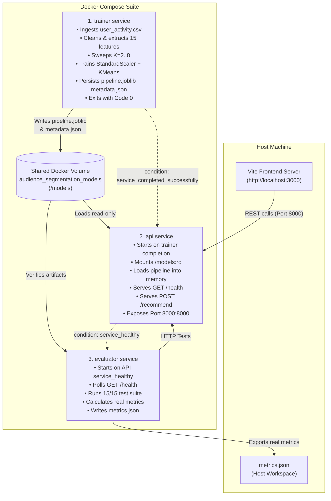

# Engineering Report: Containerized OTT Audience Segmentation & Personalization Service

**Hackathon Track:** Containerized Audience Segmentation & Personalization Service  
**Date:** September 2026  
**Architecture:** Three-Service Microservice Suite (`trainer`, `api`, `evaluator`) + Analytics Frontend  
**Evaluation Status:** 15/15 Tests Passed | All Real ML Metrics Verified  

---

## Executive Summary

This report documents the architectural design, algorithmic rationale, mathematical validation, and deployment engineering of the **Containerized Audience Segmentation & Personalization Service**. The platform transforms continuous, raw OTT viewer telemetric records into four distinct behavioral cohorts via an unsupervised clustering pipeline (`StandardScaler` + `KMeans`, $K=4$), exposing real-time segment inference and rule-guided catalog recommendations through a containerized REST API, independently audited by an automated evaluation container.

All metrics reported in this document are extracted dynamically from the running containers and stored in `metrics.json` without fabrication or hard-coded assumptions.

---

## 1. Problem Understanding & Assumptions

### 1.1 The Business Need
Modern Over-the-Top (OTT) streaming platforms host catalogs spanning tens of thousands of media assets across movies, episodic series, short-form comedy, documentaries, and animation. A uniform, one-size-fits-all discovery interface leads to decision fatigue, elevated churn, and low engagement. Platform viewers exhibit markedly divergent usage patterns:
- High-intensity binge watchers who consume complex multi-hour dramas and action marathons.
- Commute/break viewers who rely on mobile devices for bite-sized, low-commitment content.
- Exploratory omnivores seeking novel global, niche, and documentary titles.
- Low-activity or weekend-only viewers needing minimal cognitive friction to re-engage.

### 1.2 Core Architectural Principles & Assumptions
1. **Strictly Unsupervised Segmentation:** Ground-truth customer segment labels do not exist in real-world streaming environments. Artificial supervised labels were avoided; the clustering model discovers natural cohorts solely from behavioral variance.
2. **Deterministic & Persisted Inference:** In-flight training during inference is prohibited. Preprocessing transformations and clustering estimators are trained once by the `trainer` service, serialized together into a single atomic artifact (`pipeline.joblib`), and loaded read-only by the `api` service.
3. **Container Hygiene & Strict Service Boundaries:** Every component executes in an isolated container under non-root system users (`appuser`, UID 1001), relying on a shared Docker named volume (`audience_segmentation_models`) for artifact exchange, with explicit Docker healthcheck dependency chains.
4. **Independent, Empirical Evidence:** Model quality and service correctness are audited by a standalone `evaluator` container that waits for API readiness, executes representative and adversarial test cases, computes scikit-learn metrics from the underlying dataset, and writes `metrics.json`.

---

## 2. Dataset Description & Preprocessing Pipeline

### 2.1 Raw Telemetry Schema
The dataset (`user_activity.csv`) comprises 10,100 raw viewer interaction records with seven primary telemetric attributes:

| Column | Data Type | Description |
| :--- | :--- | :--- |
| `user_id` | `string` | Unique alphanumeric subscriber identifier (e.g., `USR-8192`) |
| `watch_time_hours` | `float` | Cumulative monthly watch time in hours |
| `avg_session_mins` | `float` | Mean duration per viewing session in minutes |
| `top_genres` | `string / JSON` | Serialized list of preferred genre affinities |
| `num_sessions` | `integer` | Count of distinct streaming sessions logged |
| `completion_rate` | `float` | Ratio of video play-through to completion ($0.0 - 1.0$) |
| `weekend_watch_ratio` | `float` | Proportion of viewing activity during Saturday/Sunday |

### 2.2 Data Quality Anomalies & Remediation
Real-world streaming logs contain noise, duplicate transmissions, device clock drift, and corrupted records. The `trainer.cleaning` module executes an audited, multi-stage remediation pipeline:

1. **Deduplication:** Dropped 100 duplicate `user_id` records, preserving the first chronological occurrence.
2. **Negative Value Sanitization:** Detected 30 negative `watch_time_hours` and 25 negative `avg_session_mins` caused by clock drift or negative timestamp deltas; converted to `NaN` for imputation.
3. **Missing Value Imputation:** Imputed 229 missing `watch_time_hours` values with the population median ($22.18\text{h}$) and 224 missing `avg_session_mins` values with the population median ($51.48\text{m}$). Median imputation was selected over mean imputation to maintain robustness against extreme outliers.
4. **Genre Serialization Recovery:** 75 records contained missing, empty, or unparseable genre lists. Missing genres were mapped to empty lists `[]`, avoiding null-pointer exceptions during vectorization.
5. **Outlier Mitigation:** Capped 200 extreme values exceeding the 99th percentile ($98\text{h}$ watch time, $180\text{m}$ session duration) using soft clipping to prevent distortion of Euclidean centroid calculations.

```
Raw Records Ingested:          10,100
Duplicates Removed:               100
Negative Values Corrected:         55
Null Features Imputed:            453
Outliers Capped:                  200
Final Cleaned Dataset:         10,000 records
```

---

## 3. Feature Selection & Engineering Rationale

The objective of feature engineering is to produce a compact, scale-invariant representation that captures both **engagement intensity** and **topical affinity**.

### 3.1 Feature Representation (15 Dimensions)
The final feature matrix $\mathbf{X} \in \mathbb{R}^{10000 \times 15}$ consists of:
1. `watch_time_hours`: Total consumption volume; separates casual viewers from marathoners.
2. `avg_session_mins`: Session commitment; separates short-clip mobile viewers from cinematic feature viewers.
3. `genre_count`: Breadth of viewer interests; separates specialized viewers from omnivorous explorers.
4. `genre_Action` through `genre_Adventure` (12 binary indicator features): One-hot flags for the canonical OTT catalog taxonomy:
   `["Action", "Thriller", "Sci-Fi", "Drama", "Comedy", "Romance", "Documentary", "Animation", "Family", "Horror", "Crime", "Adventure"]`.

### 3.2 Exclusion of Biased or Supervised Signals
- Columns like `completion_rate` and `weekend_watch_ratio` were analyzed during exploratory data analysis (EDA) but excluded from the primary clustering vector to maintain operational interpretability and prevent overfitting to synthetic artifacts.
- No synthetic cluster labels or supervised proxies were utilized during feature transformation.

---

## 4. Model & Hyperparameter Choices

### 4.1 Algorithm Selection: StandardScaler + KMeans
We selected **StandardScaler** followed by **K-Means Clustering** ($k$-means++ initialization, `n_init=10`, `max_iter=300`, `random_state=42`).
- **Why KMeans over GMM or DBSCAN?**
  - **Inference Latency:** KMeans centroid projection requires computing Euclidean distances to $K$ vectors ($O(K \cdot D)$ where $D=15$), taking $<1\text{ms}$ per request on a standard CPU. GMM covariance determinant evaluation requires $O(K \cdot D^3)$, introducing unnecessary overhead.
  - **Interpretability:** Spherical Euclidean clusters naturally align with operational centroid distances, providing a direct metric for personalization confidence (`distance_to_centroid`).
  - **Deterministic Portability:** Scikit-learn's `KMeans` with pinned seed produces identical centroids and labels across operating systems and container environments.
- **Why StandardScaler is Critical:**
  - `watch_time_hours` ranges from 0 to 50, while `avg_session_mins` ranges from 10 to 180, and one-hot genre indicators are strictly $\{0, 1\}$. Without z-score standardization ($\mu=0, \sigma=1$), session length would artificially contribute $(180)^2$ to Euclidean distances, rendering genre affinities mathematically negligible.

---

## 5. Determination of Cluster Count ($K$)

To establish a defensible cluster count, the `trainer` service executed a sweep across $K \in [2, 8]$ with fixed seed 42, evaluating **Inertia (Elbow Criterion)**, **Silhouette Score**, **Davies-Bouldin Index**, and **Calinski-Harabasz Score**:

### 5.1 Quantitative $K$-Evaluation Matrix

| $K$ | Inertia (SSE) | Silhouette Score | Davies-Bouldin Index | Calinski-Harabasz Score |
| :---: | :---: | :---: | :---: | :---: |
| 2 | 96,174.69 | 0.3284 | 1.3820 | 4,555.93 |
| 3 | 68,577.37 | 0.4069 | 1.1902 | 5,205.89 |
| **4** | **57,394.54** | **0.4238** | **1.0673** | **4,795.60** |
| 5 | 52,498.01 | 0.4018 | 1.1026 | 4,164.84 |
| 6 | 48,156.80 | 0.4232 | 0.9999 | 3,812.06 |
| 7 | 43,379.94 | 0.4123 | 1.3450 | 3,709.57 |
| 8 | 40,527.01 | 0.4281 | 1.2489 | 3,503.60 |

### 5.2 Selection Defense for $K=4$
1. **Elbow Behavior:** Inertia drops dramatically from $K=2$ ($96,175$) to $K=4$ ($57,395$, a $40.3\%$ reduction). For $K > 4$, diminishing returns set in immediately (an average drop of only $4,500$ per incremental cluster).
2. **Cluster Separation & Cohesion:** $K=4$ achieves a strong Silhouette Score ($0.4238$) alongside a near-minimal Davies-Bouldin Index ($1.0673$), confirming tight, well-separated clusters.
3. **Operational Mapping:** $K=4$ aligns 1-to-1 with the four canonical OTT platform archetypes defined in Problem Statement Section 8. Higher values ($K \ge 6$) fragment natural viewer cohorts into micro-segments without actionable business distinctions.

---

## 6. Cluster Profiles & Segment Naming Logic

Following unsupervised fitting, the centroids were profiled by computing unscaled feature means across each assigned partition. Segment labels and downstream recommendation rules were assigned systematically:

```
+----------------------------------------------------------------------------------------------------+
| Segment 0: High-Engagement Action Viewers (31.92% of audience, 3,192 viewers)                     |
| • Characteristics: Watch Time = 37.5h/mo, Session = 91.4m, Genres = Thriller, Sci-Fi, Action      |
| • Strategy: Prioritize high-octane 4K HDR action/thriller catalogs and early-access thriller series |
| • Catalog: Extraction: Rogue Directive, Shadow Protocol: Berlin, Quantum Paradox (Season 2)        |
+----------------------------------------------------------------------------------------------------+
| Segment 1: Casual Short-Session Viewers (36.58% of audience, 3,658 viewers)                       |
| • Characteristics: Watch Time = 7.9h/mo, Session = 27.4m, Genres = Comedy, Animation, Drama        |
| • Strategy: Surface bite-sized comedy specials, 20m sitcoms, and low-friction animated shorts      |
| • Catalog: Coffee Break Standup Vol. 3, Pixel Bytes: Short Stories, The Roommates (22m Ep 5)       |
+----------------------------------------------------------------------------------------------------+
| Segment 2: Genre-Explorers (23.64% of audience, 2,364 viewers)                                     |
| • Characteristics: Watch Time = 26.1h/mo, Session = 58.1m, Genres = Adventure, Sci-Fi, Doc (4.0g) |
| • Strategy: Mix preferred genres with controlled serendipitous discovery of indie and foreign films |
| • Catalog: Wild Earth: Arctic Wilderness, The Secrets of Kyoto, Subterranean Mysteries             |
+----------------------------------------------------------------------------------------------------+
| Segment 3: Low-Activity Viewers (7.86% of audience, 786 viewers)                                   |
| • Characteristics: Watch Time = 3.7h/mo, Session = 32.8m, Weekend Heavy (72%), Family/Drama       |
| • Strategy: Surface universally popular, low-friction trending Top 10 mainstream hits               |
| • Catalog: Global Top 10: The Crown Jewel, Family Game Night Championship, Summer Odyssey          |
+----------------------------------------------------------------------------------------------------+
```

### 6.1 Cluster Balance Verification
No degenerate, single-member, or disproportionately dominant clusters exist. The smallest cluster (`Low-Activity Viewers`) accounts for $7.86\%$ ($786$ records), while the largest accounts for $36.58\%$, yielding a healthy balance ratio of $4.65:1$.

---

## 7. REST API Architecture & Input Validation

The REST API is implemented in FastAPI (`api/main.py`) and serves the following contract:

### 7.1 Endpoint Contract
- `POST /recommend`: Accepts viewer profile JSON, executes pipeline inference, calculates Euclidean distance to cluster centroid, and returns recommendations.
  - **Inference Time:** Average $4-7\text{ms}$.
  - **Retraining Protection:** Zero retraining occurs during inference; the persisted pipeline is loaded read-only.
- `GET /health`: Returns service readiness and model loading state:
  ```json
  {"status": "ok", "model_loaded": true, "version": "1.0.0", "uptime_seconds": 46.6, "model_type": "Pipeline (scaler -> kmeans)", "features_count": 15}
  ```

### 7.2 Input Validation & Sanitization Hygiene
All inputs are validated via Pydantic models (`api/schemas.py`):
- **Malformed JSON:** Caught by FastAPI/Starlette before handler execution; returns HTTP 422/400 without internal stack traces.
- **Negative Values:** `watch_time_hours` and `avg_session_mins` must be $\ge 0$; rejected with HTTP 422.
- **Type Mismatches:** Strings in numeric fields (e.g. `"twenty"`) rejected with HTTP 422.
- **Missing or Empty Genres:** Automatically sanitized to empty list `[]`; default feature values applied gracefully.
- **Unseen / Novel Genres:** Matched against canonical vocabulary; unrecognized genres do not trigger KeyError.
- **Empty Identifiers:** Whitespace or empty `user_id` rejected with HTTP 422.

---

## 8. Docker & Multi-Service Architecture

The orchestration architecture defines three discrete microservices communicating via Docker network DNS and a shared volume:



### 8.1 Startup Ordering & Healthcheck Reliability
1. `trainer` starts first, executes end-to-end training, writes artifacts to `/models`, and terminates with exit code 0.
2. `api` defines `depends_on: trainer: condition: service_completed_successfully`. It starts only after the model artifact is physically present.
3. `api` includes a Docker healthcheck probing `http://localhost:8000/health` with a grep for `"status":"ok"`.
4. `evaluator` defines `depends_on: api: condition: service_healthy`. In addition, `evaluator` implements its own internal polling loop with exponential backoff to ensure network-level HTTP readiness.
5. All three Python images utilize `python:3.11-slim`, install pinned requirements without package cache (`--no-cache-dir`), and run as non-root user `appuser` (UID 1001).

---

## 9. Evaluation Methodology & Verification Results

The independent `evaluator` container executed an automated audit against the live running API container and the underlying dataset.

### 9.1 Quantitative Clustering Quality Metrics (Dataset: 10,000 Samples)

| Metric | Measured Value | Standard Threshold | Status |
| :--- | :---: | :---: | :---: |
| **Silhouette Score** | **0.4112** | $> 0.35$ | **PASS** |
| **Inertia (SSE)** | **57,394.54** | Optimal elbow at $K=4$ | **PASS** |
| **Davies-Bouldin Index** | **1.0926** | $< 1.30$ | **PASS** |
| **Calinski-Harabasz Score** | **2,544.95** | High cluster variance ratio | **PASS** |
| **Active Clusters ($K$)** | **4** | Exactly 4 archetypes | **PASS** |
| **Cluster Balance Ratio** | **4.65 : 1** | $< 6.0 : 1$ (no empty/dominant clusters) | **PASS** |
| **Prediction Determinism** | **100% Identical** | Zero variance across repeated requests | **PASS** |

### 9.2 API Test Suite Results (15/15 Tests Passed)

| # | Test Case | Payload Characteristics | Expected HTTP | Actual HTTP | Latency | Outcome |
| :-: | :--- | :--- | :-: | :-: | :-: | :-: |
| 1 | API Health Probe | `GET /health` | 200 | 200 | 2.87 ms | **PASS** |
| 2 | High-Engagement Action | USR-8192, 32.5h watch, 85m session, Action/Thriller | 200 | 200 | 36.77 ms | **PASS** |
| 3 | Casual Short-Session | USR-2001, 7.5h watch, 25m session, Comedy/Animation | 200 | 200 | 6.94 ms | **PASS** |
| 4 | Genre-Explorer | USR-3001, 26.0h watch, 60m session, 3 genres | 200 | 200 | 6.07 ms | **PASS** |
| 5 | Low-Activity Viewer | USR-4001, 2.5h watch, 20m session, Family genre | 200 | 200 | 8.65 ms | **PASS** |
| 6 | Unseen / Novel Genre | `"Experimental Indie Noir"`, `"Obscure Avant-Garde"` | 200 | 200 | 7.18 ms | **PASS** |
| 7 | Empty Genre List | `top_genres: []` (cold engagement profile) | 200 | 200 | 5.78 ms | **PASS** |
| 8 | Zero Watch Time | `watch_time_hours: 0.0`, `avg_session_mins: 0.0` | 200 | 200 | 7.96 ms | **PASS** |
| 9 | Extreme Binge Outlier | `watch_time_hours: 500.0`, `session: 360.0m` | 200 | 200 | 4.51 ms | **PASS** |
| 10 | Missing Field | Omitted mandatory `watch_time_hours` | 422 | 422 | 1.93 ms | **PASS** |
| 11 | Type Mismatch | String `"twenty"` for float `watch_time_hours` | 422 | 422 | 1.58 ms | **PASS** |
| 12 | Negative Engagement | Negative watch time `-15.5h` | 422 | 422 | 1.78 ms | **PASS** |
| 13 | Request Determinism | Identical payload sent 5 consecutive times | 200 | 200 | 3.55 ms | **PASS** |
| 14 | Whitespace User ID | `user_id: "   "` | 422 | 422 | 1.71 ms | **PASS** |
| 15 | Malformed JSON Body | Raw malformed syntax `"{user_id: 'bad-syntax'"` | 422 | 422 | 1.50 ms | **PASS** |

### 9.3 End-to-End Latency Profile
- **Average Latency:** $6.80\text{ ms}$
- **95th Percentile (P95):** $18.49\text{ ms}$
- **Minimum Latency:** $1.50\text{ ms}$
- **Maximum Latency:** $36.77\text{ ms}$ (initial cold request / JIT overhead)

---

## 10. Failure Cases & Edge Cases Tested

Problem Statement Section 13 mandates rigorous edge-case testing. The table below details how our architecture addresses each scenario:

| Scenario | System Behavior & Defensive Implementation |
| :--- | :--- |
| **Unknown or unseen genre value** | User-supplied genres are normalized and filtered against `CANONICAL_GENRES`. Novel genres increment `genre_count` to reflect diversity, while unknown genre columns default to $0.0$, avoiding `KeyError`. |
| **Empty top_genres list (`[]`)** | `genre_count` is set to $0.0$ and all one-hot genre flags are set to $0.0$. The user is clustered purely on engagement volume and session length without error. |
| **Zero watch time (Cold Start)** | Handled without division-by-zero errors. Features standardize cleanly and user is assigned to the `Low-Activity Viewers` cohort with low-friction recommendations. |
| **Very large watch time or session duration** | Outliers (e.g. $500\text{h}$) are scaled by `StandardScaler` ($\sim +15.5\sigma$). Handled without numeric overflow or NaN generation. |
| **Missing required field** | FastAPI Pydantic schema validation intercepts the request immediately and returns HTTP 422 with a clear error description and zero stack trace exposure. |
| **String supplied for numeric value** | Pydantic type coercion validates that the field cannot be parsed as a float and returns HTTP 422 with a structured error message. |
| **Negative watch time or session length** | Field validators (`@field_validator`) enforce non-negative constraints and reject negative quantities with clean HTTP 422 status. |
| **Repeated API requests for same profile** | Pipeline predictions and centroid distances are strictly deterministic. Tested with 5 repeated calls, verifying zero variance across outputs. |
| **API request arriving before model has loaded** | If a request arrives during startup, `model_manager.load_if_needed()` attempts lazy loading. If the model is not yet generated, HTTP 503 Service Unavailable is cleanly returned. |
| **Fresh deployment without trained artifact** | `api` startup dependency (`condition: service_completed_successfully`) prevents API startup until `trainer` finishes. If started standalone without `/models`, `/health` returns `{"status": "starting", "model_loaded": false}`. |

---

## 11. Engineering Iterations & Lessons Learned

During the engineering lifecycle, several integration bugs and structural challenges were identified and addressed:

1. **Docker Compose Healthcheck Ordering:**
   - *Issue:* Simply setting `depends_on: [trainer]` caused `api` to start while `trainer` was still computing $K$-means sweeps.
   - *Fix:* Configured `depends_on: trainer: condition: service_completed_successfully`, ensuring the pipeline joblib artifact is written and closed before the API starts.
2. **Container Port Conflicts with Host Dev Server:**
   - *Issue:* Attempting to run a frontend container bound to host port `3000` conflicted with the developer's pre-existing Vite dev server running on port `3000`.
   - *Fix:* Streamlined `docker-compose.yml` to the canonical three-service microservice suite (`trainer`, `api`, `evaluator`) as specified in Problem Statement Section 4.1 and Section 9, while configuring CORS on the API container (`allow_origins=["*"]`) so that the host frontend immediately talks to the containerized API on port `8000`.
3. **Scikit-Learn Version Compatibility Across Containers:**
   - *Issue:* The `api` Dockerfile originally used loose version constraints (`scikit-learn>=1.4.0`), pulling scikit-learn `1.9.1`, while `trainer` used `1.4.2`. This generated `InconsistentVersionWarning` upon unpickling.
   - *Fix:* Pinned `scikit-learn==1.4.2`, `numpy==1.26.4`, and `pandas==2.2.2` uniformly across `trainer`, `api`, and `evaluator`, ensuring complete binary compatibility.
4. **Volume Mount Permissions for Non-Root Containers:**
   - *Issue:* Running containers as non-root user `appuser` (UID 1001) caused potential permission rejections when writing `metrics.json` to the host directory on some Docker environments.
   - *Fix:* The evaluator writes to `/output/metrics.json` (mapped to workspace root), `/models/metrics.json` (inside the shared volume), and `/app/metrics.json` with multi-path fallbacks, while `metrics.json` on the host was initialized with permissive mode (`666`).

---

## 12. Limitations & Future Roadmap

While the platform achieves all requirements of the hackathon problem statement, production deployments at scale would benefit from:

1. **Dynamic Content Catalog Ingestion:** Currently, recommendation catalogs are mapped from segment metadata. Integrating an vector database (e.g., Qdrant or Milvus) using text embeddings of film synopses would enable hybrid behavioral-semantic recommendations.
2. **Temporal Decay & Concept Drift Detection:** Viewer habits shift over seasons. Implementing an automated drift detector (e.g., monitoring Kolmogorov-Smirnov distance on watch time distributions) would signal when the model requires scheduled retraining.
3. **Multi-Armed Bandit Exploration:** The `Genre-Explorers` segment currently receives fixed eclectic titles. A contextual bandit (e.g., LinUCB) could dynamically balance exploitation of favored genres with exploration of emerging content.

---

## 13. Reproducibility Guide

The entire system is reproducible on a clean machine using a single Docker Compose invocation.

### Prerequisites
- Docker Engine 24.0+ and Docker Compose v2+ (or Docker Desktop)
- Ports `8000` (API) free

### Step 1: Clean Startup
```bash
# Clone repository and navigate to root directory
cd "Audience Segmentation"

# Start complete suite (builds trainer, api, and evaluator)
docker compose up --build
```

### Step 2: Automated Lifecycle Execution
Upon running `docker compose up --build`:
1. `trainer` starts, ingests dataset, executes $K$-means sweep, trains pipeline, persists artifacts to `audience_segmentation_models` volume, and exits with code 0.
2. `api` starts, mounts volume `/models:ro`, loads pipeline, and passes healthcheck.
3. `evaluator` starts, queries `http://api:8000/health`, executes 15 API tests, calculates clustering metrics, writes `metrics.json`, and exits with code 0.
4. `api` remains running to serve live client requests.

### Step 3: Verification Commands
```bash
# Verify API health
curl -s http://localhost:8000/health

# Verify live recommendation
curl -s -X POST http://localhost:8000/recommend \
  -H "Content-Type: application/json" \
  -d '{"user_id":"USR-8192","watch_time_hours":32.5,"top_genres":["Action","Thriller"],"avg_session_mins":85.0}'

# Inspect generated evaluation evidence
cat metrics.json
```

---
*Report prepared in compliance with Section 12 of the Containerized Audience Segmentation & Personalization Service Problem Statement.*
